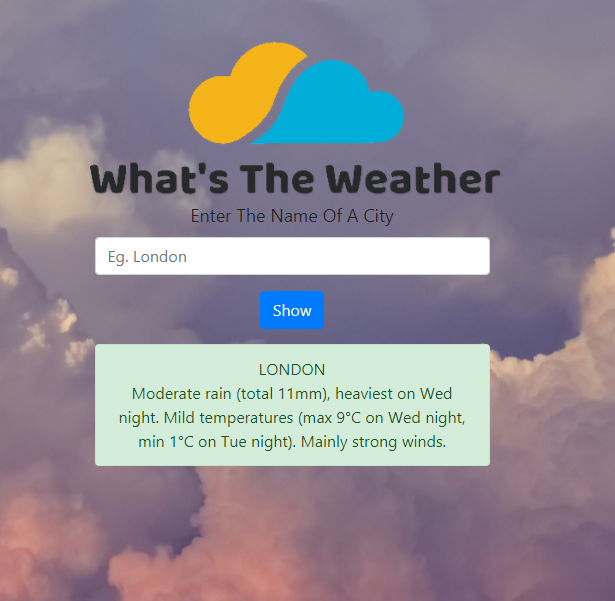

# What's The Weather 

#### A Weather app where you can know the current weather update of any city in the world. 

## Built With
- PHP
- Bootstrap
- HTML and CSS

This is my first application using php. I am learning php, and now i am really enjoying this technology. My main objective of this 
project is to learn how to get contents from other web page or sites. 

It will be admirable for any kind of suggestions and feedbacks.

## Made with :heart: by [Abdur Rahman Robin](https://github.com/robin3317)
- [Facebook](https://facebook.com/robin4java)
- [Twitter](https://twitter.com/robin4java)
- [Linkedin](https://www.linkedin.com/in/robin4java/)

### :relaxed:  :relaxed:  :relaxed:  :relaxed:  :relaxed: Happy Coding :relaxed:  :relaxed:  :relaxed:  :relaxed:  :relaxed:
